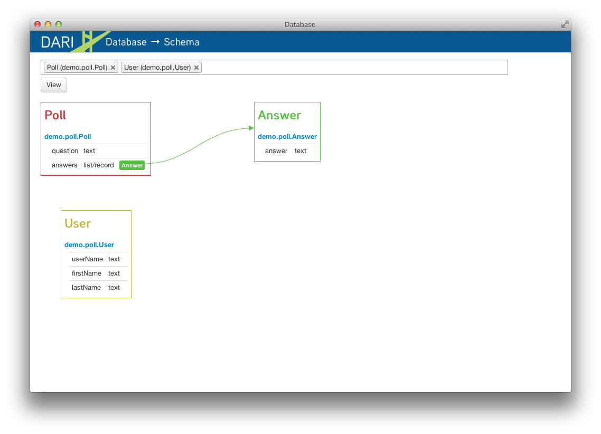
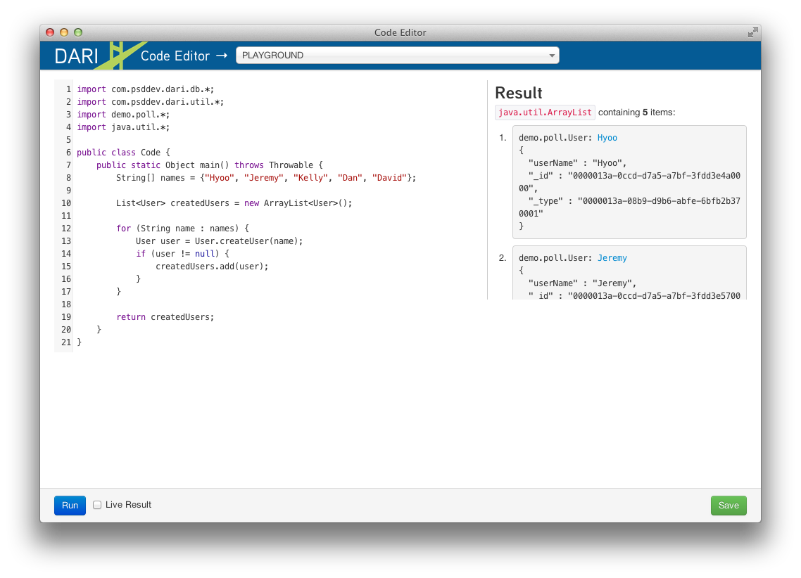
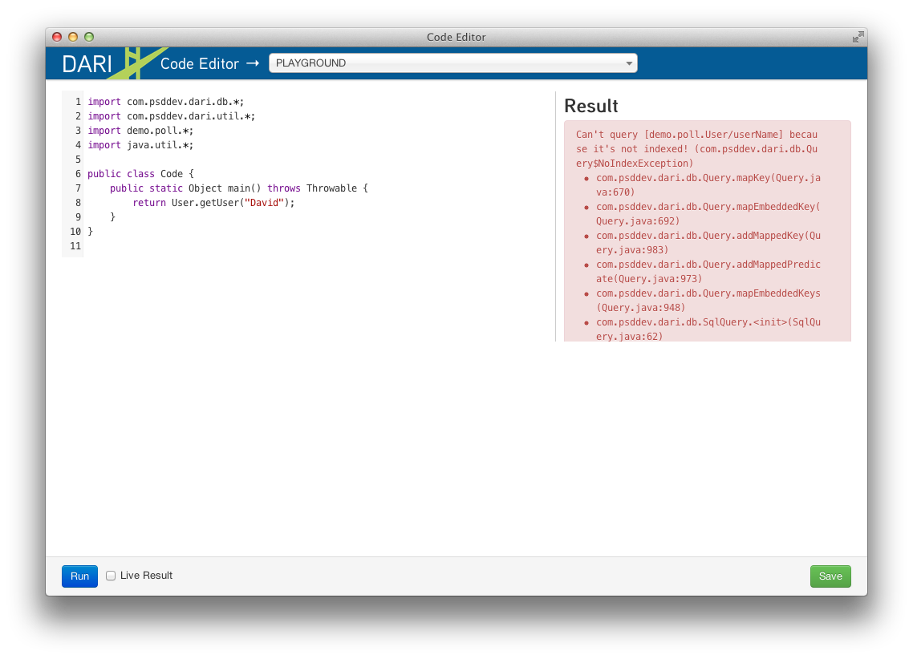
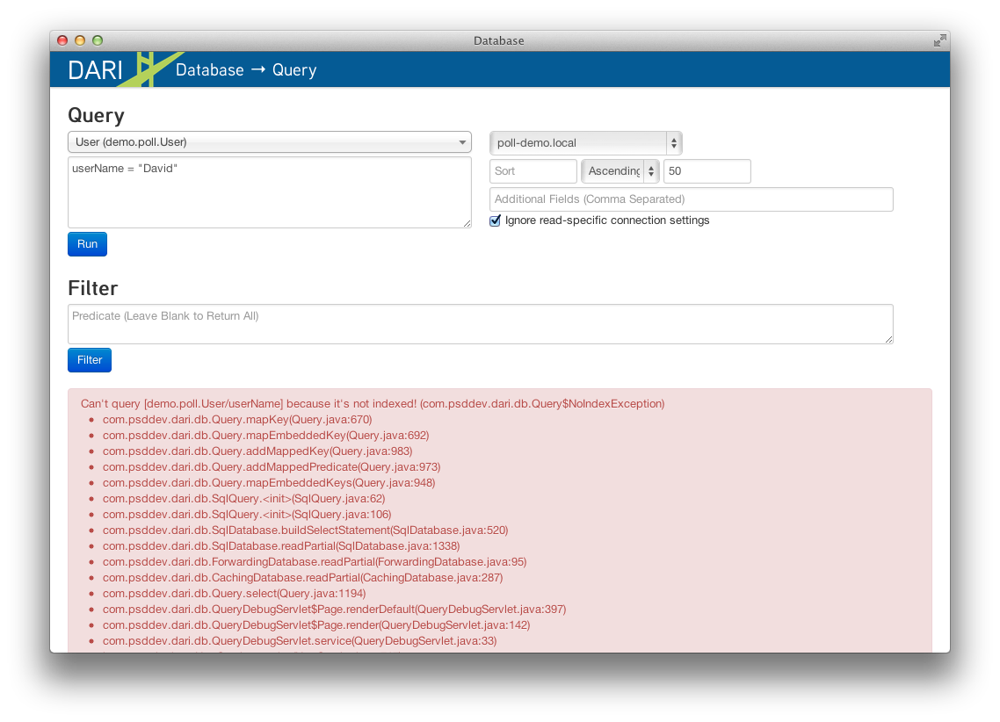
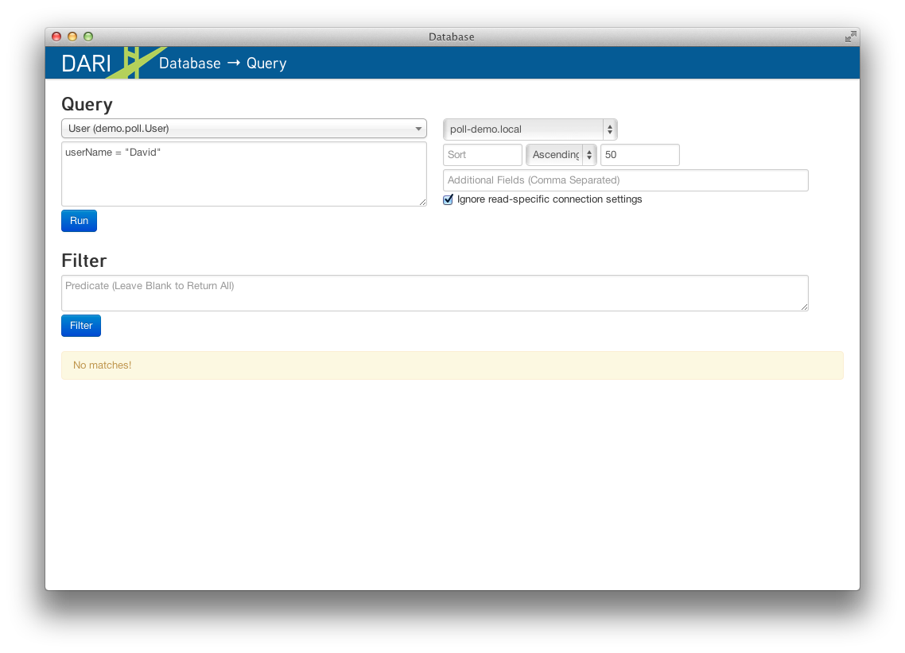
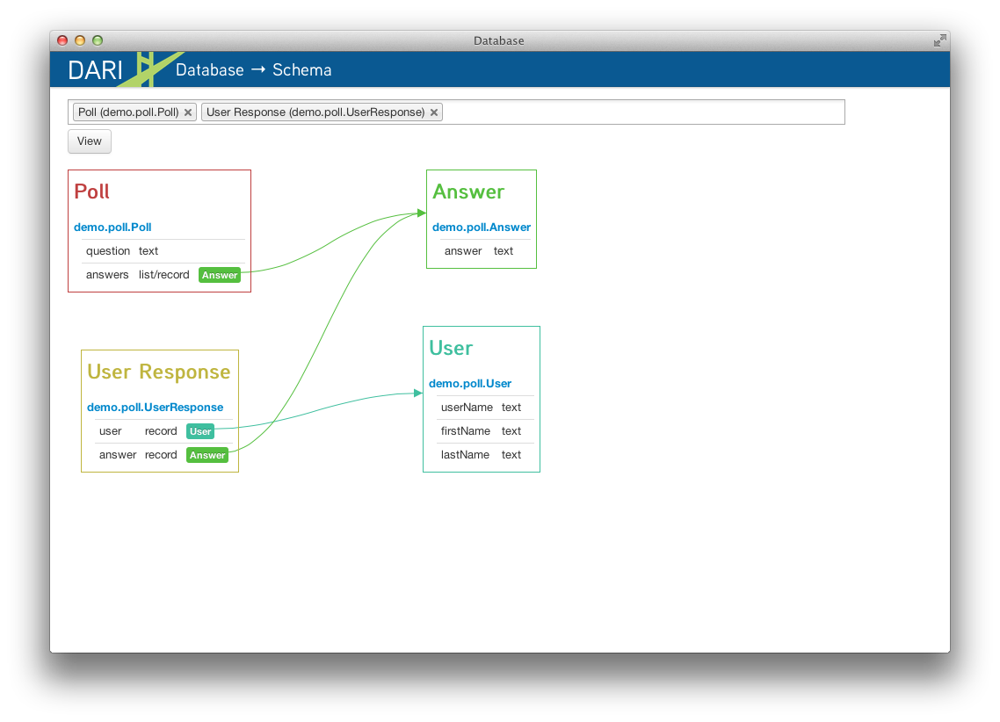
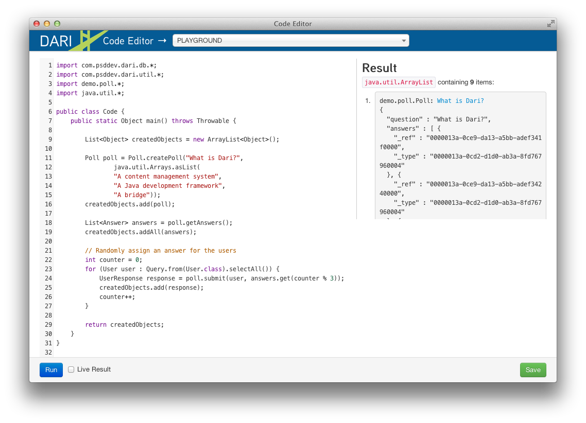

## Getting Started

### Maven Archetype

Dari provides a Maven archetype to help you quickly setup a new Dari web
project. After running this command you will have a project directory
named after the `artifacedId` you provided.

This archetype has been tested with Maven version 3.x.

    mvn archetype:generate -B \
        -DarchetypeRepository=http://public.psddev.com/maven \
        -DarchetypeGroupId=com.psddev \
        -DarchetypeArtifactId=dari-app-archetype \
        -DarchetypeVersion=2.0-SNAPSHOT \
        -DgroupId=com.yourcompany  \
        -DartifactId=yourproject

### Running the Application

You can run the application using the Jetty maven plugin.

    mvn package cargo:run

After Tomcat starts up browse to
[http://localhost:8080](http://localhost:8080) to see the
default Dari webpage.

### Maven Archetype Setup

The directory generated by the Maven archetype is a standard Maven web
project. A settings.properties file configured to use the Java
H2 database is provided along with a simple index page.

    pom.xml
    src/main/java/com/yourcompany/DefaultRouter.java
    src/main/resources/settings.properties
    src/main/webapp/index.jsp
    src/main/webapp/WEB-INF/web.xml

### Writing you first Dari Application ###

We're going to use the classic Poll application as our example.  We want to be
able to create polls, let users submit their answers, and then view statistics
on the poll after they're done.

You can download the complete example [here](/assets/dari-poll-demo.tar.gz).

The main goal of this tutorial is help you understand how different object
models will affect how you query and save data in Dari.  Dari is not
an "object relational mapping" framework so typical problems that arise in those
frameworks won't necessarily apply here. Another goal is to showcase how easy it
is to change your model once you've started developing. And lastly, we will
introduce you to the various debugging tools that are provided for you out of
the box when you use Dari.

Let's start off by creating a few simple Java classes that we know we'll need
in our application.


import com.psddev.dari.db.Record;

public class Poll extends Record {
    private String question;
    private List<Answer> answers;
}

public class Answer extends Record {
    private String answer;
}

public class User extends Record {
    private String userName;
    private String firstName;
    private String lastName;
}


The most notable piece of code here is that all the objects extend `Record`. 
Every Dari-aware object must extend `Record` whether that be directly or from
an ancestor. The getters and setters have been omitted both for brevity but also
because they aren't required to start saving and querying objects in Dari. With
this little bit of setup we have a working model that Dari understands.  We can
get a visualization of this model by accessing the Dari debug tool at
http://localhost:8080/_debug/ in your browser and clicking on `db-schema`. From
the dropdown multi-select both Poll and User and click View.

Now, lets jump into it and start writing some code to save and query objects,
but first lets add a setter method to our User class for convenience.


public class User extends Record {
    private String userName;
    private String firstName;
    private String lastName;

    public void setUserName(String userName) {
        this.userName = userName;
    }
}


Now if we go back to the debug interface there is another tool called `code`
which will let us execute arbitrary snippets of code right from our browser.
Go there and paste the following code into the editor:


import com.psddev.dari.db.*;
import com.psddev.dari.util.*;
import demo.poll.*;
import java.util.*;

public class Code {
    public static Object main() throws Throwable {
        String[] names = {"Hyoo", "Jeremy", "Kelly", "Dan", "David"};

        List<User> createdUsers = new ArrayList<User>();

        for (String name : names) {
            User user = new User();
            user.setUserName(name);
            user.save();
            createdUsers.add(user);
        }

        return createdUsers;
    }
}


This will loop over each of the names and create a User object, and then with
`save()` API that is inherited from `Record` will persist the object to the
database.  We store the created users in a list and return it just so the code
tool prints the internal representation of the objects we just created as
shown in the figure below:

Now that we've saved some User objects lets query for them still using the code
tool.  Replace the code in the main method with the following snippet.


return Query.from(User.class).selectAll();


Clicking Run yields the same results as when we created the users initially
because the `selectAll()` method returns a List of all the User objects in the
database. You can read more about writing queries in Dari in the
[Querying section](querying.html) of the documentation.

In addition to writing code, we can also query for objects using yet another
dari debug tool aptly named `query`.
 

    <strong>NOTE:</strong>
    
Whenever a debug tool is referenced, you can always reach it through
    your browser by going to http://localhost:8080/_debug/[the name of the tool]
    or by clicking the DARI logo in the top left corner and then selecting it
    from list of under Standard Tools.

From the query tool select `User` from the TYPES dropdown and click Run.  The
results are filtered to show all the user's we've created.  The next logical
thing we want to be able to do is to query on a specific field on the object,
in this case the user's name.  In the text area under the TYPES dropdown type:

    userName = "David"

Oops! We get an error saying "Can't query [demo.poll.User/userName] because
it's not indexed!". This is because whenever we want to query on specific
fields we need to annotate them with `@Indexed`.  You'll see that if you execute
the corresponding query in code, you will get the same error:

Let's go back and update all our classes to have this annotation.


import com.psddev.dari.db.Record;

public class Poll extends Record {
    @Indexed private String question;
    private List<Answer> answers;
}

public class Answer extends Record {
    @Indexed private String answer;
}

public class User extends Record {
    @Indexed private String userName;
    private String firstName;
    private String lastName;
}


    <strong>TIP:</strong>
    
It is a common mistake to get carried away and add the @Indexed
    annotation to all the fields on every class created.  Doing so creates
    extra potentially unnecessary rows in the underlying database and can lead
    to poor performance in systems with large amounts of data. Only add the
    annotation to fields that you think you will query on.

Now let's try to re-run our query. (Don't forget to select User from dropdown
first).

Ooops! No results were found. This is because our User objects were saved
prior to adding the `@Indexed` annotation, so it only applies to new objects
that we create.  Once again the Dari debug tools will come to our rescue.  Go
to the `db-bulk` debug tool.  We will use the Indexer to fix the indexes on the
Records that are missing them.  Select `demo.poll.User` from the dropdown
leaving the other fields as their defaults for now, and click Start.  This kicks
off a background task that we can monitor in yet another Dari debug tool by
clicking the link generated under **Ongoing Tasks**.

We'll come back to the `task` tool later, first lets go retry our query to make
sure our fields are indexed.

Voila!! 1 result found for "David".

To execute this same query in code it would look like:


Query.from(User.class).where("userName = ?", "David").selectAll();


Before moving on, let's take a quick look at some of additional features the
`query` tool has to offer.  If you click on the link under Label in the result
set a popup window will show displaying the raw JSON data for the record.
Additionally, there is a tab to edit the raw JSON, as well as a user friendly
tab that lets you edit the fields individually.  Notice how even though we don't
have data for the firstName and lastName fields the auto-generated UI still
presents a form where we can edit this metadata.

Now that we've got the basics of querying down, lets get back to creating that
Poll application we've already forgotten about.  We need a way to store a user's
response to the Poll and then find out how many people took the poll as well
as the distribution of the answers.  So lets add a new class UserResponse.


public class UserResponse extends Record {
    @Indexed private User user;
    @Indexed private Answer answer;
}

 
The UserResponse object now has both a User and and Answer which is all the data
we need to capture a user's Response.  Now to get the stats for the poll all
we should have to do is write a Query that joins the Poll object with the
UserResponse object to find out how many responses we got.

But wait... Dari does NOT support joins (in the traditional sense) as it is NOT
an object relational mapping to database tables.  However, dari does support
sub-queries. Let's quickly fire up the `db-schema` tool again to see how our
model looks now. Make sure to select them all from dropdown.

To get the number of responses to a poll we need a way to access the Poll from
the UserResponse.  The arrows show though that we can only get to User and
Answer objects which both lead to dead ends.  Similarly, from a Poll we can
reach only Answer objects where we again hit a dead end.  Even still, lets try
to construct a query that gets us our answer. Suppose we already have Poll
`poll` that we want stats for and have added getters and setters where
appropriate:


Poll poll = Query.findUnique(Poll.class, "question", "What is Dari?");
List<Answer> answers = p.getAnswers();

int responseCount = Query.from(UserResponse.class)
    .where("answer = ?", answers)
    .count();


Dari will find all the responses that have one of the answers in the list.
This works fine for our simple Poll application, however it breaks down if you
have a model where the List can be very large.  You can think of it has an `IN`
clause in SQL where you have `id IN (answerId1, answerId2, answerId3)`. It
becomes more inefficient as the size of the list grows. We can improve this by
using sub-queries.  But first we'll need to update our model.  Let's change it
so we have access to the Poll object from the UserResponse object.


public class Poll extends Record {
    @Indexed private String question;
}

public class Answer extends Record {
    @Indexed private String answer;
    @Indexed private Poll poll;
}


We added `Poll poll` to our Answer object and removed the `List<Answer> answers`
from the Poll object. We flipped the relationship such that Poll's no longer
contain answers, Answer's instead have Polls.  Now, we have a clear line from
UserResponse to all of the other objects. Let's create a new query to answer
the same question as before.


Poll poll = Query.findUnique(Poll.class, "question", "What is Dari?");
Quer<Answer> answersQuery = Query.from(Answer.class).where("poll = ?", poll);

int responseCount = Query.from(UserResponse.class)
        .where("answer = ?", answersQuery)
        .count();


Even though we create 2 queries here we only ever execute 1 via the `count()`
method. The `answersQuery` object is passed into the where clause and dari can
then optimize how the `count()` method is exectuted.  This is known as a Dari
sub-query.

Lastly, Dari provides an extremely convenient slash syntax for performing
sub-queries, so we can reduce our query code down to just a single line:


Poll poll = Query.findUnique(Poll.class, "question", "What is Dari?");
int responseCount = Query.from(UserResponse.class)
    .where("answer/poll = ?", poll)
    .count();


This is effectively the same sub-query as the previous example except written
more concisely.  Dari can also handle nesting to levels deeper than just the
single sub-query shown here, but be aware that the further you nest the more
complex the underlying query will become and performance could suffer.

With this new model we can now answer all the questions we need to power our
poll Application.

What are the Poll questions?.

Query.from(Poll.class).selectAll();



Poll poll = Query.from(Poll.class).where("question = ?", "What is Dari?").first();


What are the possible answers for Poll `poll`?

Query.from(Answer.class)
    .where("poll = ?", poll)
    .selectAll();


How many responses are there for Poll `poll`?

Query.from(UserResponse.class)
        .where("answer/poll = ?", poll)
        .count();


What is the distribution of answers for Poll `poll`?

Map<Answer, Long> pollResults = new HashMap<Answer, Long>();

List<Grouping<UserResponse>> groupings = Query.from(UserResponse.class)
        .where("answer/poll = ?", poll)
        .groupBy("answer");

for (Grouping<UserResponse> grouping : groupings) {
    List<Object> keys = grouping.getKeys();
    Object key0 = keys.get(0);

    if (key0 instanceof Answer) {
        Answer answer = (Answer) key0;
        long answerCount = grouping.getCount();

        System.out.println(answerCount + ": " + answer.getAnswer());
    }
}


The `groupBy()` method is discussed in more detail in the
[Querying section](querying.html) of the documentation.

You can download the [full demo](/assets/dari-poll-demo.tar.gz), complete with
a UI showcasing the application [here](/assets/dari-poll-demo.tar.gz).  After
installing, go to your browser at http://localhost:8080/create-poll.jsp to see
it.

To install and run, simply uncompress the tarball:

    tar -xzf dari-poll-demo.tar.gz

Change to the directory:

    ls
    cd dari-poll-demo

And run the application with:

    mvn package cargo:run

For more information on Dari please refer to the rest of the documentation.
Thanks! Enjoy!